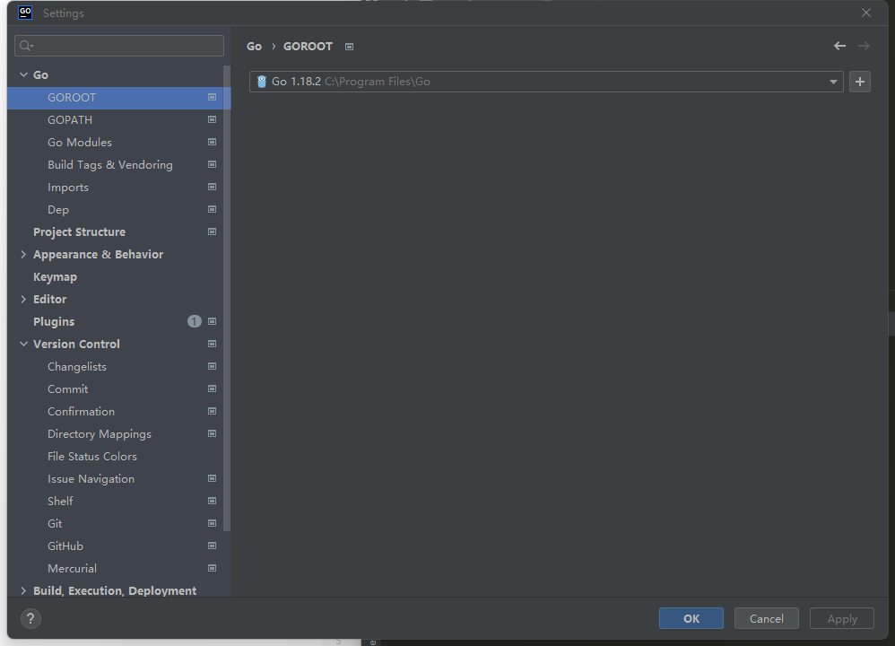
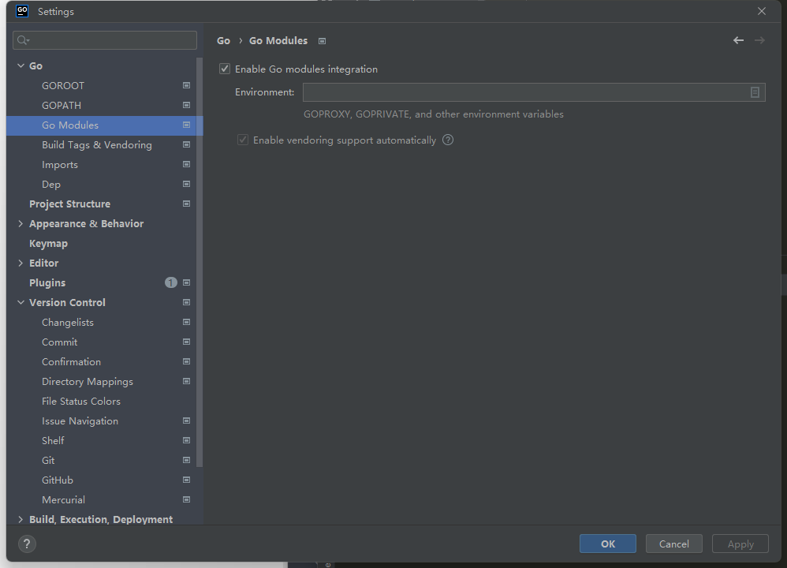
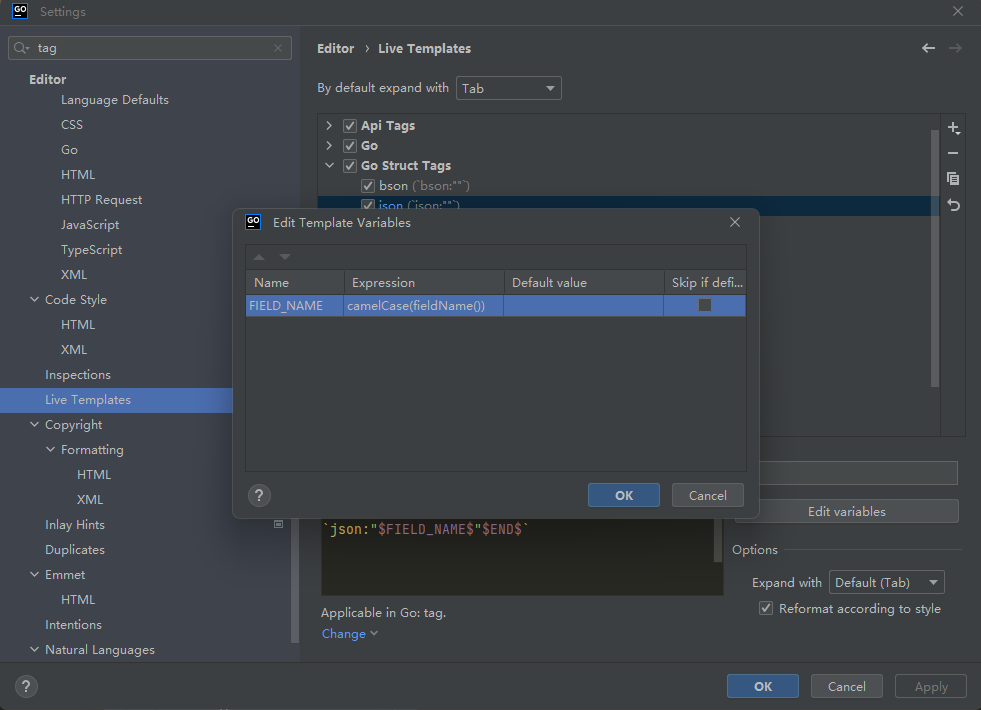

# 1. IDE

## 1.1 IDE下载地址
Vscode [https://code.visualstudio.com/](https://code.visualstudio.com/)

Goland(推荐) [https://www.jetbrains.com/go/download/](https://www.jetbrains.com/go/download/)

## 1.2 Goland配置项
GOROOT配置已安装的Go 
Go Modules 
Go struct tag 